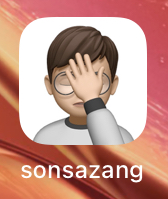

udemy - iOS -> 35강 완료 
sonsazang 앱 빌드 완료 

# 첫 앱 빌드 완료 - sonsazang

##### 아이콘

##### 화면
{: width="40%" height="40%"} 

# iOS ERROR

##### Xcode - 앱 빌드 후 런치 에러 - 해결 완료

[링크참조](https://ujeon.medium.com/xcode-%EC%95%B1-%EB%B9%8C%EB%93%9C-%ED%9B%84-%EB%9F%B0%EC%B9%98-%EC%97%90%EB%9F%AC-ef2f0ce47ad8) 
The operation couldn’t be completed. Unable to launch org.reactjs.native.example.pado because it has an invalid code signature, inadequate entitlements or its profile has not been explicitly trusted by the user. 
 

##### failed to prepare device for developemnt 에러 - 문제 없음

Xcode, iOS 버전 호환 에러 - 무시 
[링크참조](https://developer.apple.com/forums/thread/133106) 

# jekyll 댓글 기능 -> disqus

구현 필요 - [링크](https://jamesu.dev/posts/2020/01/03/adding-disqus-comment-service-to-jekyll/) 

